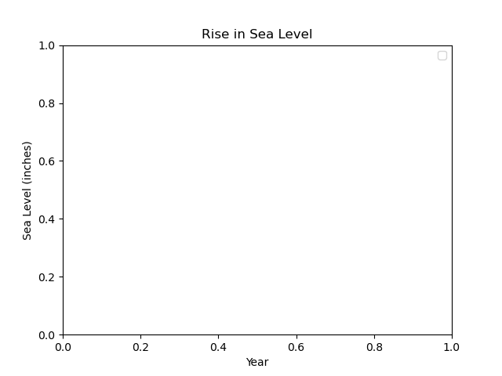

# 🌊 Sea Level Predictor

This project analyzes historical sea level data from 1880 to 2013 and uses linear regression to predict sea level rise through 2050. It is one of the required projects for the freeCodeCamp **Data Analysis with Python** certification.



---

## 📌 Project Objectives

- Load and explore historical sea level data from the U.S. Environmental Protection Agency.
- Create a scatter plot of the raw data.
- Generate two lines of best fit using linear regression:
  - **1880–2050** (based on all data)
  - **2000–2050** (based on recent data only)
- Predict and visualize sea level trends through 2050.

---

## 🛠️ Technologies Used

- **Python**
- **Pandas** for data manipulation
- **Matplotlib** for data visualization
- **SciPy** for statistical modeling and linear regression

---

## 📊 File Overview

- `epa-sea-level.csv` — Dataset with yearly sea level measurements (inches) from 1880 to 2013.
- `sea_level_predictor.py` or `.ipynb` — Script/notebook for performing analysis and creating the plot.
- `sea_level_plot.png` — Final graph showing:
  - Historical scatter plot data
  - First regression line (1880–2050)
  - Second regression line (2000–2050)

---

## 📈 Output Preview

The graph clearly shows:
- A consistent upward trend in sea levels.
- A **faster rate of rise** in more recent years (2000–2013).
- Future sea level predictions through 2050 based on historical trends.

---

## 🚀 How to Run the Project

1. Clone this repo or download the files.
2. Make sure you have Python and the required libraries:
   ```bash
   pip install pandas matplotlib scipy

